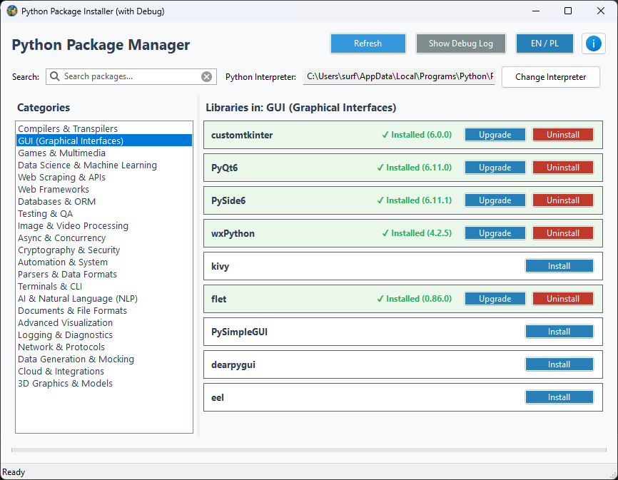

# Python Package Manager



<p align="center">
  
  
  
</p>

Moderny, wielojęzyczny (PL/EN) menedżer pakietów Python z graficznym interfejsem użytkownika opartym na bibliotece **wxPython**. Narzędzie pozwala w łatwy i intuicyjny sposób przeglądać najpopularniejsze biblioteki podzielone na ponad 20 kategorii tematycznych, sprawdzać stan ich instalacji w bieżącym środowisku oraz instalować je jednym kliknięciem za pomocą bezpiecznych procesów wielowątkowych.

---

## 🚀 Główne Funkcje

- **Wielowątkowa Instalacja (`pip`)**: Instalacja pakietów odbywa się w tle bez blokowania i zawieszania interfejsu graficznego (GUI).
- **Automatyczna Detekcja**: Program automatycznie skanuje bieżące środowisko Pythona i dynamicznie oznacza już zainstalowane biblioteki (zielona karta z symbolem ✓).
- **Konsola Diagnostyczna (Debug)**: Wbudowany, rozwijany podgląd logów instalacyjnych na żywo ułatwia śledzenie postępu i rozwiązywanie problemów.
- **Wielojęzyczność (Dual-Language)**: Pełne, dynamiczne wsparcie dla języka polskiego i angielskiego za pomocą jednego przycisku (bez restartu aplikacji).
- **Dopracowany, Moderny UI**: Estetyczna szata graficzna z kartami pakietów, precyzyjnym podziałem kolumn i dynamicznym paskiem postępu.

---

## 📦 Kategoryzacja Bibliotek

Aplikacja zawiera predefiniowaną, bogatą bazę najlepszych bibliotek podzielonych na kategorie tematyczne:
- 🛠️ **Kompilatory i Transpilatory** (`pyinstaller`, `nuitka`, `cython`...)
- 🎨 **GUI i CLI** (`customtkinter`, `PyQt6`, `rich`, `textual`...)
- 🎮 **Gry i Multimedia** (`pygame`, `arcade`, `panda3d`...)
- 📊 **Data Science, ML & AI** (`pandas`, `scikit-learn`, `transformers`, `openai`...)
- 🌐 **Web Scraping & Frameworki** (`requests`, `beautifulsoup4`, `django`, `fastapi`...)
- 🗄️ **Bazy danych & Chmura** (`sqlalchemy`, `pymongo`, `boto3`...)
- 🛡️ **Kryptografia & Sieć** (`cryptography`, `scapy`, `paramiko`...)
- 📁 **Dokumenty & Raporty** (`openpyxl`, `pypdf`, `python-docx`...)

---

## 🛠️ Wymagania i Instalacja

Przed uruchomieniem upewnij się, że masz zainstalowany interpreter języka Python oraz wymagane biblioteki.

1. **Klonowanie repozytorium:**
   ```bash
   git clone https://github.com/polsoft-IT/python-package-manager.git
   cd python-package-manager
   ```

   2. **Instalacja zależności:**
      ```bash
   pip install -r requirements.txt
   ```

   3. **Uruchomienie programu:**
      ```bash
   python python_package_manager.py
   ```

   4. **Budowanie pojedynczego pliku EXE:**
      - Windows batch:
        ```bat
        build_exe.bat
        ```
      - PowerShell:
        ```powershell
        .\build_exe.ps1
        ```
      - Lub użyj dostarczonego pliku spec:
        ```powershell
        python -m PyInstaller python_package_manager.spec
        ```

   Wygenerowany plik wykonywalny znajdziesz w katalogu `dist`.

   ```
📝 Informacje o Projekcie
Autor: Sebastian Januchowski

Firma / Grupa: polsoft.ITS™ Group

E-mail: polsoft.its@mail.com

GitHub: https://github.com/polsoft-IT

Wyprodukowano przez polsoft.ITS™ Group. Wszystkie prawa zastrzeżone.